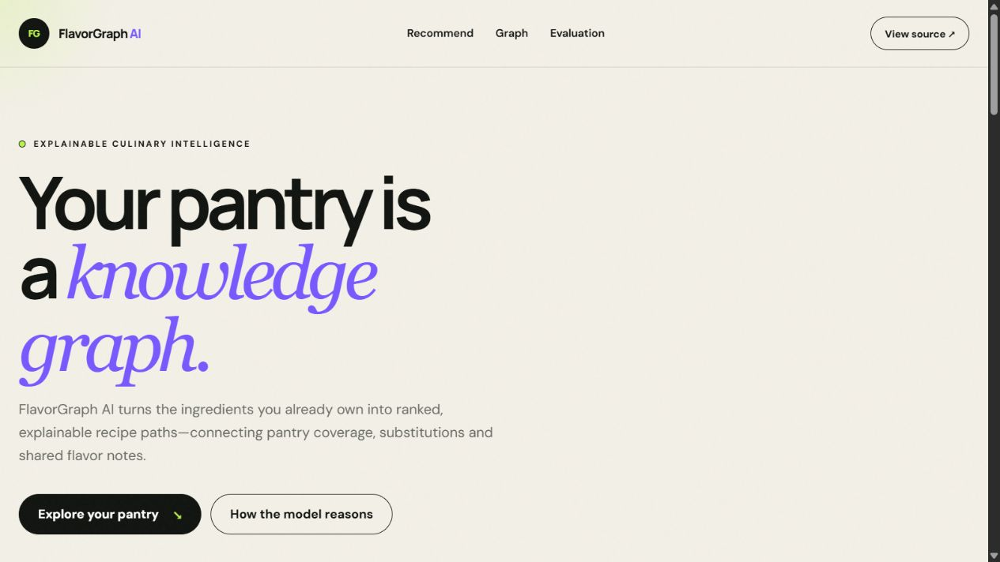
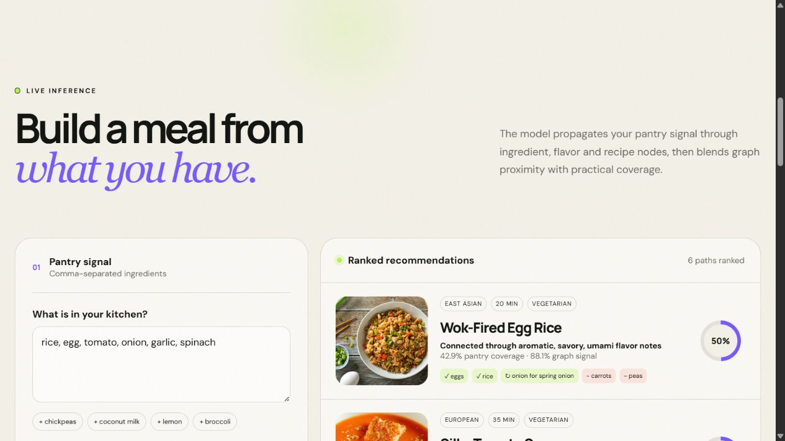
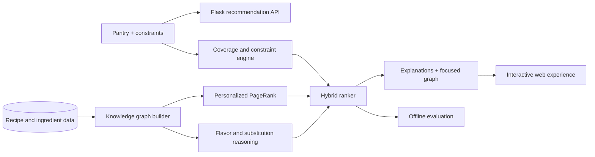
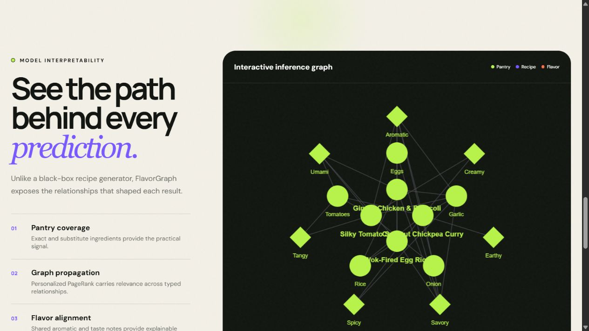

# FlavorGraph AI 🍅🕸️

> An explainable culinary recommendation system that turns pantry ingredients into ranked recipe paths using a heterogeneous knowledge graph and Personalized PageRank.



## Why this project exists

Most recipe finders behave like keyword search: if the exact ingredient is missing, the result disappears. FlavorGraph models the relationships between **recipes, ingredients, flavors, cuisines, and substitutions** instead. Its hybrid ranker can recommend a useful recipe even when literal overlap is incomplete—and explains the evidence behind every score.

## What makes it an AI/ML engineering project

- 🕸️ **Heterogeneous knowledge graph** with typed, weighted relationships
- 🎯 **Personalized PageRank** seeded from a user's pantry
- 🧠 **Hybrid recommendation model** combining coverage, graph relevance, flavor alignment, convenience, and missing-item penalties
- 🔁 **Ontology-driven substitutions** with human-readable explanations
- 🔍 **Model interpretability** through matched ingredients, graph signals, flavor bridges, and an interactive inference subgraph
- 📊 **Reproducible evaluation** against an exact-overlap baseline
- 🧪 **Automated API and model tests**, linting, Docker, and CI



## System architecture



### Graph schema

| Node types | Relationship types |
|---|---|
| Recipe, Ingredient, Flavor, Cuisine | `contains`, `expresses`, `substitutes`, `belongs_to`, `tastes_like` |

The current catalog contains 12 curated recipes across 8 cuisines and roughly 50 profiled ingredients. This compact dataset keeps the reasoning inspectable; it is a strong baseline for a later embedding or GNN experiment.

## Ranking model

For each eligible recipe, the model computes:

```text
score = 0.52 × pantry_coverage
      + 0.25 × normalized_graph_signal
      + 0.18 × flavor_alignment
      + 0.05 × convenience
      − 0.035 × unresolved_missing_items
```

The graph signal is produced by a deterministic weighted Personalized PageRank implementation with pantry ingredients as personalization seeds. Diet, cuisine, time, and allergy constraints are applied before ranking.



## Evaluation

`python scripts/evaluate.py` runs a deterministic pantry-holdout experiment. For every recipe it exposes 45% of ingredients, injects substitution noise when possible, and compares the hybrid model with exact ingredient coverage.

| Metric (`k=3`) | Exact-overlap baseline | Hybrid graph ranker |
|---|---:|---:|
| Hit Rate@3 | 1.000 | 1.000 |
| Precision@3 | 0.333 | 0.333 |
| Mean Reciprocal Rank | 1.000 | 1.000 |
| Catalog Coverage | 1.000 | 1.000 |

The models tie on this small curated benchmark. That is reported deliberately rather than claiming an unsupported lift. The next meaningful experiment is a larger public recipe corpus with train/validation/test splits and ranking metrics such as NDCG@K.

See the [model card](docs/MODEL_CARD.md) for assumptions, limitations, and responsible-use notes.

## Run locally

```bash
python -m venv .venv
# Windows: .venv\Scripts\activate
# macOS/Linux: source .venv/bin/activate
pip install -r requirements-dev.txt
python app.py
```

Open `http://127.0.0.1:5000`.

### API example

```bash
curl -X POST http://127.0.0.1:5000/api/recommend \
  -H "Content-Type: application/json" \
  -d '{"ingredients":["rice","egg","tomato","onion"],"diet":"any","max_time":30}'
```

Endpoints:

- `GET /api/health` — service and catalog status
- `POST /api/recommend` — ranked recommendations and focused graph payload
- `GET /api/evaluate` — reproducible baseline comparison

## Engineering workflow

```bash
python -m pytest -q
python -m ruff check .
python scripts/evaluate.py
```

GitHub Actions runs linting and tests on every push and pull request. The repository also includes a production Gunicorn configuration, `Dockerfile`, and one-click Render blueprint.

## Project layout

```text
FlavorGraph-AI/
├── app.py                         # Flask application and API
├── src/flavorgraph/engine.py      # graph construction, ranking, explanations
├── data/                          # curated recipe and ingredient ontology
├── templates/ + static/           # responsive interactive experience
├── tests/                         # engine and API tests
├── scripts/evaluate.py            # reproducible offline benchmark
├── docs/MODEL_CARD.md             # model transparency
└── .github/workflows/ci.yml       # automated quality gate
```

## Roadmap

- Import and validate a larger open recipe dataset
- Learn ingredient and recipe embeddings; compare with the deterministic baseline
- Add NDCG@K, Recall@K, coverage, diversity, and ablation studies
- Introduce user feedback and offline experiment tracking
- Add semantic ingredient normalization and multilingual aliases
- Explore a GraphSAGE or LightGCN recommender after sufficient interaction data exists

## Resume-ready summary

> Built an explainable recipe recommender using a heterogeneous NetworkX knowledge graph and weighted Personalized PageRank; designed a hybrid ranking pipeline, interpretable graph visualizations, REST APIs, reproducible offline evaluation, automated tests, CI, and containerized deployment.

## License

Released under the [MIT License](LICENSE).
